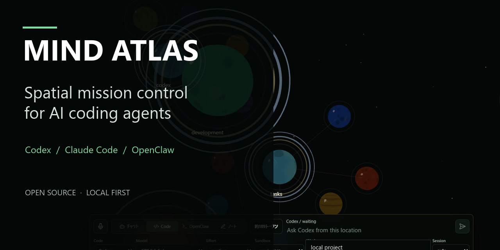
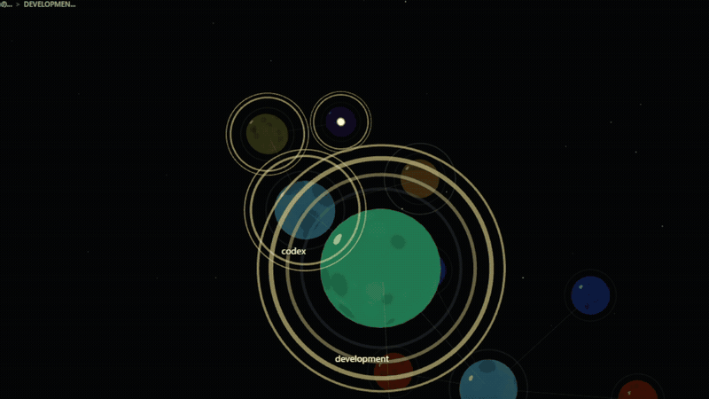
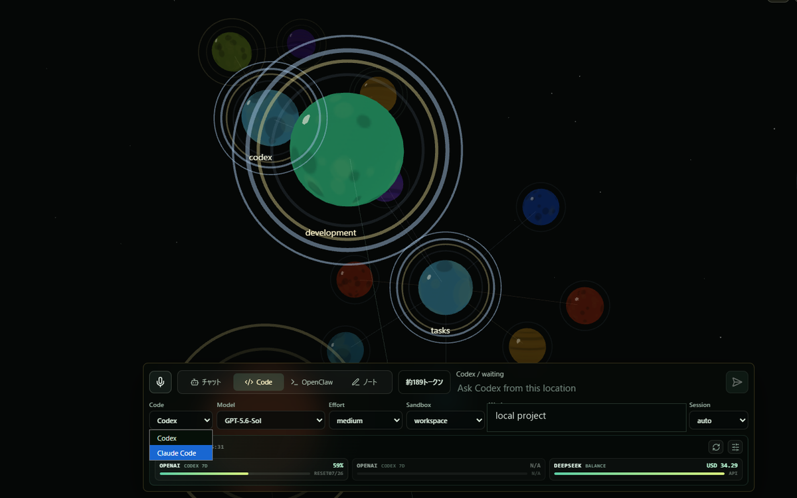
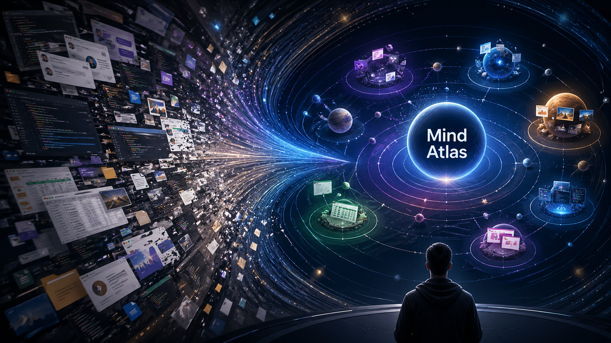

# Mind Atlas



**Spatial mission control for Codex, Claude Code, and OpenClaw.**

[](LICENSE)


[Public notebook](https://mind-atlas.org) · [Run locally](#run-the-agent-workspace-locally) · [Agent bridge details](docs/ai-bridge.md) · [Contributing](CONTRIBUTING.md)



AI coding agents are fast. Keeping track of parallel requests, branches,
approvals, logs, and results is not. Mind Atlas turns that work into a
navigable 2.5D space: each request stays attached to its project context, and
completed work calls your attention with a visible notification pulse.

## Why Mind Atlas

- **See parallel agent work.** Codex, Claude Code, and OpenClaw runs become
  spatial request/result branches instead of disappearing into terminal tabs.
- **Return to the right context.** Select a node and continue the work from its
  branch history, nearby notes, files, and prior agent output.
- **Recover interrupted results.** Local agent requests are journaled before
  execution and restored after browser or bridge interruption.
- **Keep powerful tooling local.** Work roots, command execution, provider
  credentials, and agent logs stay in the local developer bridge.

## Run the agent workspace locally

```powershell
git clone https://github.com/openceo2025/mind-atlas.git
cd mind-atlas
npm install
npm run dev:all
```

Open the local URL printed in the terminal. The notebook works without an AI
provider. Install and configure at least one supported CLI (`codex`, `claude`,
or `openclaw`) to run real local coding-agent work. See
[docs/ai-bridge.md](docs/ai-bridge.md) for provider and Windows setup.



> [!IMPORTANT]
> The agent mission-control surface is local-only. The public hosted service at
> `mind-atlas.org` intentionally hides work roots, shell execution, Codex,
> Claude Code, OpenClaw, local provider controls, and local credentials.

Mind Atlas is also a 2.5D spatial notebook for navigating parallel
AI-assisted work. Each visible object is an editable notebook node. You can
pan, zoom, focus, inspect attachments, and re-enter a work stream from the same
spatial context.

Production hosting currently runs on a ConoHa VPS. GitHub is the public source
repository and collaboration record, not the production database, secret store,
or customer-data archive.

Current version: `0.1.1`

Mind Atlas is open source under `AGPL-3.0-only`. The project accepts
community contributions under the [Contributor License Agreement](CLA.md).
The Mind Atlas name and official branding are governed separately by the
[trademark policy](TRADEMARKS.md).

Commercial use of the community source is allowed only under the obligations
of the GNU AGPL and the trademark policy. Organizations that need proprietary
embedding, closed-source hosted modifications, OEM/white-label use, license
compatibility exceptions, or contractual support need separate written
commercial terms. See [COMMERCIAL-LICENSE.md](COMMERCIAL-LICENSE.md) and
[docs/licensing-and-commercial-boundary.md](docs/licensing-and-commercial-boundary.md).

## What This Prototype Does

- Renders a fixed-orientation 2.5D universe view with pan, zoom, focus, and semantic drill-down.
- Treats one visible object as one local notebook/chat-bubble node.
- Lets the user edit the focused node body in the Focus panel and directly on visible node labels.
- Supports mouse-first creation of child nodes and sibling branch nodes.
- Stores notebook data in IndexedDB with retained local snapshots and restore history.
- Exports and imports a single `.mindatlas` JSON file.
- Initializes the local notebook back to the seeded starting state.
- Attaches image, audio, video, or file metadata to a node.
- Previews selected image/audio/video files during the current browser session.
- Extracts shared `#tags` from notebook text for later resonance behavior.
- Provides appearance controls for node color and texture.
- Sends the focused node context to a local AI bridge and saves each user request plus provider result as child notebook nodes.
- Saves OpenAI-generated images as attachments on the provider result node.
- Groups OpenAI, Opus/Anthropic, DeepSeek, and LM Studio/OpenAI-compatible local models under one Chat entry for non-agent conversation.
- Groups Codex CLI and Claude Code under one Code entry, while OpenClaw remains a separate model-selectable agent-style bridge mode.
- Shows selectable OpenAI Codex rate-limit windows and DeepSeek balance bars inside the AI command dock.
- Saves and loads rich `.mindatlaspkg` notebook packages through the local bridge's server-side notebook folder.
- Expands Codex runs into spatial child nodes for summaries, commands, changed files, approval prompts, and final output.
- Sends OpenClaw requests through the local bridge and stores the OpenClaw result, session key, and log path on the request branch.
- Sends Claude Code requests through the local bridge and stores the Claude Code result and log path on the request branch.
- Emits wider notification pulses when AI work completes or fails away from the user's current focus.
- Uses the microphone button for short-click dictation with `gpt-4o-transcribe`.
- Uses long-press push-to-talk for a Realtime Voice Partner that can inspect and operate the atlas through guarded tools.
- Shows a square stop button while Voice Partner audio is responding, so the current reply can be canceled before the next push-to-talk turn.
- Provides main-menu controls for Voice Partner restart, Realtime model/voice settings, and mobile-only notification alerts.
- Keeps Voice Partner conversation logs in a global text log view from the main menu.
- Defaults Voice Partner to `gpt-realtime-2`; set `MIND_ATLAS_REALTIME_MODEL` and `VITE_MIND_ATLAS_VOICE_IDLE_TIMEOUT_MS` when testing another model or a shorter idle-summary cycle.

Embeddings, summarization automation, sync, and remote storage are intentionally out of scope for `0.1.x`.



## Technology

- Vite
- React
- Three.js / React Three Fiber
- Zustand
- TypeScript

## Local Development

Install dependencies:

```powershell
npm install
```

Start the app and local AI bridge together:

```powershell
npm run dev:all
```

Open locally:

```text
http://127.0.0.1:5173/
```

`npm run dev:all` also publishes the dev app and bridge on the LAN. Open the LAN URL printed in the terminal from another device, for example:

```text
https://192.168.0.14:5173/
```

For mobile microphone access, `dev:all` starts the app and bridge over HTTPS by default and writes local development certificates into `.certs/`. Install `.certs/mind-atlas-dev-ca.crt` as a trusted CA on the mobile device, then open the printed LAN HTTPS URL.

On Android, copy `.certs/mind-atlas-dev-ca.crt` to the phone and install it from the system security settings as a CA certificate. The exact menu name depends on the device, but it is usually under `Settings > Security > Encryption & credentials > Install a certificate > CA certificate`. Restart the browser after installing it.

To temporarily go back to HTTP:

```powershell
$env:MIND_ATLAS_DEV_HTTPS="false"
npm run dev:all
```

Start only the development server:

```powershell
npm run dev
```

Open:

```text
http://localhost:5173/
```

Or start the optional local AI bridge in a second terminal:

```powershell
$env:MIND_ATLAS_OPENAI_API_KEY="sk-..."
npm run dev:bridge
```

Without an API key, the bridge returns mock AI responses so the UI flow remains testable.

For Chat mode, the command dock can switch the service between OpenAI, Opus,
DeepSeek, and Local, then choose a model and any supported effort level. Chat
requests use the same Mind Atlas context and tool definitions as the previous
OpenAI/Local entry. With an active node, the reply is saved as a child request
branch. From the root surface, the request and reply go to the AI Partner log.

For OpenClaw mode, start the local bridge and use the OpenClaw settings row for
agent, session, and timeout controls. Mind Atlas does not override the OpenClaw
model or work root; it uses the defaults configured in OpenClaw. From the root
surface, OpenClaw replies are written to the AI Partner log. With a non-root
node selected, OpenClaw creates the same request/result branch as other
node-anchored AI runs.

For Code mode on Windows, choose either Codex or Claude Code from the Code
settings row. To use Claude Code, install Claude Code and point the bridge at
the Windows executable:

```powershell
npm run dev:bridge
```

Put local Claude values in `.env.local`, which is read by both `npm run
dev:bridge` and `npm run dev:all`:

```ini
MIND_ATLAS_CLAUDE_BIN=C:\Users\<you>\AppData\Local\Microsoft\WinGet\Links\claude.exe
MIND_ATLAS_CLAUDE_ANTHROPIC_API_KEY=sk-ant-...
MIND_ATLAS_CLAUDE_DEEPSEEK_AUTH_TOKEN=sk-...
```

Anthropic does not expose the Claude Console organization-credit balance
through a public API, so Mind Atlas does not display or request a manually
entered Anthropic balance.

To start only Vite for LAN testing without the AI bridge:

```powershell
npm run dev -- --host 0.0.0.0
```

Then open the LAN URL shown by Vite, for example:

```text
http://192.168.0.14:5173/
```

## Build

```powershell
npm run build
```

The production app is generated in `dist/`.

Preview the production build:

```powershell
npm run preview
```

### Shogi Landing Page

The static landing page at `https://mind-atlas.org/shogi/` is built from
`sites/shogi-landing/` and exported into `public/shogi/`, which the root build
copies into `dist/`. Preview what the source currently produces without
touching the deployed page:

```powershell
npm run site:shogi:export
```

See [sites/shogi-landing/README.md](sites/shogi-landing/README.md) for the
publish command and for the current drift between that source and the page
being served.

## Hosted VPS Service

Mind Atlas can also be built as a small paid hosted service for
`mind-atlas.org`. In hosted mode, the public UI keeps the notebook available
without login, shows a top-right `AI機能` button, and unlocks only Chat and
Realtime Talk after Google login plus Stripe subscription. Code/Codex, Claude
Code, OpenClaw, and Local controls remain available in local developer mode but
are hidden from the public service UI.

Build hosted mode with:

```powershell
$env:VITE_MIND_ATLAS_PUBLIC_SERVICE="true"
$env:VITE_MIND_ATLAS_SERVICE_URL="https://mind-atlas.org"
npm run build
```

Run the VPS service with:

```powershell
npm run service:migrate
npm run service:start
```

See [docs/vps-service.md](docs/vps-service.md) for ConoHa VPS, PostgreSQL,
Google OAuth, Stripe, provider API key, systemd, nginx, and admin CUI setup.
Use [docs/staging-service.md](docs/staging-service.md) first to run a local
VPS-like Docker Compose environment with PostgreSQL, the hosted service, nginx,
and explicit mock Google/Stripe/provider flows. Before testing real Google
OAuth locally, fill `deploy/staging/env.service.local` and run
`npm run staging:google:doctor`.

Only templates and source code belong in GitHub. Do not commit `.env.service`,
real OAuth/Stripe/provider keys, VPS private keys, PostgreSQL dumps, customer
records, access logs, AI request logs, local notebooks, or files from
`server-data/`. See
[docs/repository-publication-safety.md](docs/repository-publication-safety.md).

## Verification

Type check:

```powershell
npm run typecheck
```

Hosted service static checks:

```powershell
npm run verify:hosted-service
npm run verify:hosted-public-ui
npm run staging:verify
npm run staging:google:doctor
npm run staging:stripe:doctor
npm run staging:openai:doctor
npm run staging:providers:doctor
npm run staging:ui:doctor
npm run staging:e2e:doctor
```

UI smoke test:

```powershell
npm run dev -- --host 127.0.0.1
npm run verify:ui
```

The UI smoke test checks desktop, mobile portrait, and mobile landscape rendering. Generated screenshots are local artifacts and are not part of the public repository.

## GitHub and Static Preview

The official production service for `mind-atlas.org` is the ConoHa VPS
deployment described above. Do not point `mind-atlas.org` DNS at GitHub Pages
while the VPS service is the production environment.

The repository still contains `.github/workflows/deploy-pages.yml` as a manual
static preview workflow. It is intentionally `workflow_dispatch` only, so
pushing source code to `main` does not replace or redeploy the production VPS
service. A static preview build does not include Google OAuth, Stripe webhook
handling, PostgreSQL, hosted credit accounting, or server-side provider keys.

## Data Notes

- Notebook data is saved in browser IndexedDB with retained local snapshots and a restore UI. The legacy `mind-atlas-notebook-v2` localStorage payload is still kept as a migration/recovery source.
- Light export and import use a single `.mindatlas` JSON file.
- Rich export and import use `.mindatlaspkg` packages and include available attachment blobs.
- Markdown (`.md`, `.markdown`), OPML (`.opml`), and FreeMind (`.mm`) files can be imported from the main menu or by drag and drop. The "Import text outline" action applies pasted Markdown to the active node by replacing its body, replacing its subtree, appending children, or previewing a node-by-node merge.
- `クラウドへ保存` writes the same rich package to the bridge server's notebook folder. `クラウドから読み込み` lists that folder and imports the selected package.
- Attachment metadata such as file name, MIME type, size, and path-like name is saved.
- Attachment blobs are included only when the current browser session still has access to them; otherwise metadata is kept.
- The default server-side notebook folder is `server-data/notebooks/`, or `MIND_ATLAS_CLOUD_DIR` when configured.
- Provider API keys belong in the local bridge process, not in browser local storage.

See [docs/ai-bridge.md](docs/ai-bridge.md) for AI bridge setup and Realtime notes.

## Repository Contents

The public repository should include source, configuration templates,
documentation, tests, deployment templates, and manual preview workflows. It
should not include dependency folders, generated builds, logs, verification
screenshots, real environment files, API keys, private keys, database dumps,
customer records, server access logs, AI request logs, or local notebook data.

## Contributing

Issues, forks, experiments, and pull requests are welcome. Before opening a
pull request, read [CONTRIBUTING.md](CONTRIBUTING.md) and agree to the
[Contributor License Agreement](CLA.md) in the pull request template.

Contributors retain copyright in their contributions while granting the
project the rights needed to distribute the open-source edition, offer
commercial licenses, and transfer the project as part of a future business or
asset transaction. Project decision-making and succession are described in
[GOVERNANCE.md](GOVERNANCE.md).

Security reports and reports containing credentials or personal data should not
be filed as public issues. See [SECURITY.md](SECURITY.md).

## License

The source code in this repository is licensed under the
[GNU Affero General Public License v3.0 only](LICENSE).

Modified versions offered to users over a network must provide those users
access to the corresponding source as required by AGPL section 13.

The AGPL does not grant rights to the Mind Atlas name, logo, domain, or other
brand identifiers. See [TRADEMARKS.md](TRADEMARKS.md).

Organizations that need to embed, redistribute, or operate modified Mind Atlas
without AGPL obligations may request separate commercial terms. See
[COMMERCIAL-LICENSE.md](COMMERCIAL-LICENSE.md).

The intended boundary between the community edition and future proprietary
Pro/Team services is documented in
[docs/licensing-and-commercial-boundary.md](docs/licensing-and-commercial-boundary.md).
