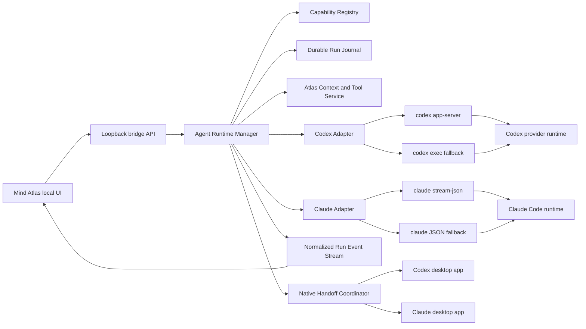

# Local Agent Mothership Plan

Status: implementation brief - phases 0 to 7 landed, see Implementation Status

Last reviewed: 2026-07-29

## Implementation Status

Machine evidence for every capability claim is in
[local-agent-poc-results.md](local-agent-poc-results.md). The implemented
behaviour is described in [ai-bridge.md](ai-bridge.md).

| Phase | State | Notes |
| --- | --- | --- |
| 0 Proofs of concept | done | Codex App Server and Claude stream-json probed live; Codex deep link and Claude `/desktop` proved unavailable and disabled |
| 1 Common durable runtime | done | `scripts/agent-runtime/` types, journal, event store, SSE replay, capability registry, fake-provider tests |
| 2 Codex App Server slice | done | persistent stdio JSON-RPC, model/effort discovery, start/resume/fork, stream, stop, steer, approvals, user input, compaction; `codex exec` fallback retained |
| 3 Claude stream slice | done | stream-json parser, route separation, resume/fork, tools, subagents, usage/cost, stop; JSON fallback retained |
| 4 Run Workspace | done | Answer / Timeline / Changes / Preview / Context, dependency-free sanitized Markdown, approval and question rows, density switch |
| 5 Context and Atlas tools | done | script-aware estimator, three separate context metrics, read-only Atlas MCP server sharing the human search matcher |
| 6 Evidence and browser | done | content-addressed evidence store, typed Codex `localImage`, honest `referenced` status elsewhere, runtime browser probe |
| 7 Ownership and handoff | done | durable handoff records, CLI resume continuity, ownership lease, explicit reclaim with Git and thread reconciliation |
| 8 Advanced parity | done | worktree-per-mission, checkpoints and revert, richer subagent visualization, terminal panes, capability browser |

Known gaps, deliberately not faked:

- Codex is not auto-configured with the Mind Atlas MCP server, because that
  would require mutating provider configuration. Claude receives it through an
  additive per-run `--mcp-config`.
- `semantic_search_nodes` is hybrid lexical plus character n-gram scoring and
  reports itself as degraded. No embedding backend is configured.
- Claude print mode exposes no steering or interactive approval channel; the
  UI reports that instead of hanging.

Primary target: Mind Atlas local developer mode on Windows

Providers in scope: Codex and Claude Code

Explicitly out of scope: OpenClaw and the public hosted AI service

## 1. Goal

Raise Mind Atlas local developer mode to the point where it can be used as the
owner's serious daily execution environment for Codex and Claude Code.

The result should feel close to each provider's native application in both
capability and usability while preserving the parts that are unique to Mind
Atlas:

- spatial branches for requests and results;
- parallel run supervision;
- persistent AI Partner notifications;
- durable recovery after the browser or bridge is interrupted;
- Atlas-aware context and search;
- explicit handoff to the native Codex or Claude application when Mind Atlas is
  not the best surface for the next step.

The target is functional parity where the provider exposes an official
integration surface. It is not pixel-for-pixel cloning of either native
application. Native-only capabilities must have an honest escape path rather
than a fake or incomplete imitation.

## 2. User Outcome

The owner should be able to do all of the following from Mind Atlas:

1. Start a serious coding run from a node or from the root surface.
2. Select the real model, effort, permission, workspace, and available tools
   reported by the installed provider runtime.
3. Watch the answer, tool work, command output, plan, file changes, retries,
   approvals, and errors as they happen.
4. Stop a run, steer an in-progress run, answer a question, or approve a
   provider action without losing the session.
5. See both Mind Atlas context injection and the provider's real session context
   usage without confusing those values.
6. Attach screenshots, images, PDFs, text files, and logs as typed evidence when
   the selected runtime actually supports them.
7. Let the agent search Mind Atlas without dumping the entire notebook into
   every prompt.
8. Review rich Markdown, tables, links, code, diffs, files, tests, terminal
   output, screenshots, and previews in a dedicated run workspace.
9. Close or restart the browser and bridge, then recover the run and its result.
10. Continue the same provider session in the native application when official
    continuity is possible.
11. Fall back to a new native session with a complete handoff package when true
    continuity is not possible.
12. Return ownership to Mind Atlas without two clients writing to the same
    provider session at once.

## 3. Scope

### 3.1 In scope

- local developer mode started by `npm run dev:all`;
- Codex local execution;
- Claude Code with a Claude subscription;
- Claude Code with Anthropic API billing;
- Claude Code routed through the existing DeepSeek-compatible configuration;
- provider capability discovery;
- durable run/session/event storage;
- live run control;
- rich local-only run UI;
- context accounting and Atlas read tools;
- multimodal evidence;
- local browser integration when the provider/runtime reports it as available;
- native application handoff;
- tests that prove the hosted build does not expose these features.

### 3.2 Out of scope

- OpenClaw changes;
- public `mind-atlas.org` agent execution;
- exposing shell, workspaces, local files, Codex, or Claude Code on ConoHa;
- replacing Codex or Claude Code's security model;
- reproducing proprietary native UI exactly;
- promising a provider capability that has not passed a local proof of concept;
- team accounts, remote orchestration, or a packaged desktop installer in the
  first implementation;
- write-capable Mind Atlas MCP tools in the first tool release.

## 4. Non-Negotiable Safety Contract

Read these files before implementation:

- `AGENTS.md`
- `docs/mode-safety-contract.md`
- `docs/ai-bridge.md`

This work is `local-only` but touches shared AI UI, routing, context, provider
selection, and environment behavior. It is therefore
`dangerous-cross-mode`.

Hard requirements:

- Hosted mode is selected by `VITE_MIND_ATLAS_PUBLIC_SERVICE=true`.
- Hosted mode must never expose Codex, Claude Code, local work roots, local
  bridge status, shell controls, native handoff, local MCP controls, local
  browser controls, or local provider credentials.
- Browser code must never receive provider keys, subscription tokens, database
  URLs, or environment-file contents.
- The local bridge must stay bound to loopback by default.
- Do not expose `codex app-server` directly on a non-loopback socket.
- Mind Atlas must not weaken provider approval, sandbox, or permission behavior.
- Raw provider HTML must never be rendered.
- Existing local mode must keep working if the richer runtime cannot start.
- Existing run recovery must remain active until the replacement has proven
  equivalent durability.
- Do not remove the current `exec` or JSON fallback during the first migration.

## 5. Current Baseline

This section records the source-backed baseline as of the review date. Verify it
again before editing because the worktree may have changed.

### 5.1 Current entry points

- Local app and bridge: `npm run dev:all`
- Bridge: `scripts/mind-atlas-bridge.mjs`
- Main agent request endpoint: `/api/ai/respond`
- Browser bridge client: `src/ai/bridgeClient.ts`
- Dispatch and notebook integration: `src/store/atlasStore.ts`
- Compact command surface: `src/components/CommandDock.tsx`
- Context planning: `src/context/contextEngine.ts`
- Root AI Partner Log rendering: `src/App.tsx`

### 5.2 Current Codex path

- The bridge uses `codex exec --json`.
- The selected model, reasoning effort, sandbox, workspace, web search,
  Git-repository behavior, and optional resume thread id are passed through the
  current `CodexSettings`.
- Codex web search is always enabled in the current local workflow.
- The bridge extracts and stores `codexThreadId`.
- The current Codex App Server use is limited mainly to account/rate-limit
  inspection, not run execution.
- The final response is turned into a result node or root AI Partner Log entry.
- Detailed provider output is stored in bridge-side logs.

Relevant source:

- `scripts/mind-atlas-bridge.mjs`: `createCodexResponse`, `runCodex`, and
  `runCodexOnce`
- `src/types.ts`: `CodexSettings`, `AiResponseResult`, and `AtlasNode`
- `src/store/atlasStore.ts`: node-anchored request/result handling and retry

### 5.3 Current Claude Code path

- The bridge uses `claude -p --output-format json`.
- Prompt and context are sent through stdin.
- Claude subscription, Anthropic API, and DeepSeek-compatible routes remain
  distinct.
- The bridge stores `claudeSessionId` and provider logs.
- Resumed branch runs use the nearest ancestor session and fork rather than
  mutating an old branch point.
- Resume failure falls back to a fresh session with full context.

Relevant source:

- `scripts/mind-atlas-bridge.mjs`: `createClaudeCodeResponse` and
  `runClaudeCode`
- `src/types.ts`: `ClaudeSettings`, `AiResponseResult`, and `AtlasNode`
- `src/context/contextEngine.ts`: session plan selection

### 5.4 Current branch/session policy

- Codex continues only when extending the tip of the same branch.
- A diverged or stale Codex branch starts a fresh thread with full context.
- Claude Code resumes the nearest ancestor session with a fork, keeping the
  stored ancestor session id immutable.
- Continued/forked runs receive a small delta prompt.
- New or fallback runs receive full context.
- The UI has a one-shot `Session = new` override.

This behavior is valuable and must be preserved through the adapter migration.

### 5.5 Current context planner

`src/context/contextEngine.ts` is the single planner for node-anchored AI
requests:

- ancestor `human_prompt` and `ai_reply` nodes become real conversation turns;
- other Atlas information becomes deterministic compact Markdown;
- breadcrumb, document chain, outline skeleton, children, and pinned selection
  are included under a budget;
- exact injected context can be previewed before sending;
- the current agent preset is approximately:
  - 16,000 total characters;
  - 9,000 conversation characters;
  - 3,000 characters per replayed turn;
  - 3,000 characters per node body;
- attachment handling in this path is primarily metadata.

The current estimate is character based. It is not reliable enough for Japanese
or for provider session accounting.

### 5.6 Current durability

The bridge journals Codex, Claude Code, and OpenClaw requests before execution.
It exposes:

- `GET /api/agent-runs/inbox`
- `POST /api/agent-runs/ack`

The app restores unacknowledged results into the original request branch when
possible. Otherwise it writes a persistent AI Partner Log entry with an unread
notification. Browser startup, visibility restoration, and periodic polling
participate in recovery.

Relevant source and tests:

- `scripts/mind-atlas-bridge.mjs`
- `src/store/atlasStore.ts`: `recoverMissedAgentRuns`
- `src/App.tsx`
- `scripts/verify-agent-run-inbox.mjs`
- `npm run verify:agent-recovery`

Do not regress the rule that a recovered run is acknowledged only after its
result is durably represented in Mind Atlas.

### 5.7 Current UI limitations

- The user mostly receives the final response instead of a structured live run.
- AI Partner Log text is rendered as plain text.
- There is no first-class timeline for commands, tools, plans, retries,
  approvals, or subagents.
- There is no integrated unified diff review.
- There is no persistent file, terminal, browser, or artifact preview area.
- Attachment metadata can enter context, but typed image/PDF transport is not a
  complete provider-neutral path.
- Mind Atlas shows an injected-context estimate, not the full provider session's
  actual context occupancy.
- Browser and provider-native tools are not capability-discovered as a unified
  runtime feature.
- Native application continuation is not yet a supported user workflow.

## 6. Target Quality Bar

Mind Atlas is ready for serious daily use only when all of these statements are
true:

- The same model, effort, repository state, and permissions produce work of the
  same class as the native application on the benchmark suite.
- A long run is understandable while it is running, not only after completion.
- Interruptions do not silently lose results.
- The user can see what context Mind Atlas injected and what the provider says
  the session actually consumed.
- Screenshots and files reach the model through a documented typed path.
- Available models, efforts, tools, and modalities come from runtime discovery.
- The native escape button never claims continuity that has not been proven.
- A handoff cannot cause concurrent writes to one provider session.
- Hosted builds contain no reachable local-agent execution surface.
- The compact command dock stays compact; detailed work moves into a dedicated
  run workspace.

## 7. Architecture

### 7.1 High-level structure



### 7.2 Recommended module boundaries

Exact paths may be adjusted to match the final code, but responsibilities must
remain separate:

```text
src/agentRuntime/
  types.ts
  capabilities.ts
  eventReducer.ts
  runViewModel.ts
  contextAccounting.ts
  handoffTypes.ts

src/components/agentRun/
  AgentRunWorkspace.tsx
  AgentAnswerView.tsx
  AgentTimelineView.tsx
  AgentChangesView.tsx
  AgentPreviewView.tsx
  AgentContextView.tsx
  AgentApprovalPrompt.tsx
  EvidenceTray.tsx

scripts/agent-runtime/
  runtime-manager.mjs
  run-journal.mjs
  event-store.mjs
  capability-registry.mjs
  codex-app-server-adapter.mjs
  codex-exec-adapter.mjs
  claude-stream-adapter.mjs
  claude-json-adapter.mjs
  handoff-coordinator.mjs
  atlas-mcp-server.mjs
```

Do not move everything in one refactor. Extract only the boundary needed for
the next vertical slice.

### 7.3 Bridge transport

Keep provider processes and secrets behind the local bridge. Use:

- ordinary HTTP for commands;
- Server-Sent Events for ordered bridge-to-browser run events;
- event sequence numbers and `Last-Event-ID` for reconnect;
- the existing journal/inbox as the compatibility recovery path.

Proposed local-only endpoints:

```text
GET  /api/agent-capabilities
POST /api/agent-runs
GET  /api/agent-runs/:runId
GET  /api/agent-runs/:runId/events
POST /api/agent-runs/:runId/steer
POST /api/agent-runs/:runId/interrupt
POST /api/agent-runs/:runId/approvals/:requestId
POST /api/agent-runs/:runId/user-input/:requestId
POST /api/agent-runs/:runId/handoff
POST /api/agent-runs/:runId/reclaim
POST /api/agent-runs/:runId/ack
```

The current `/api/ai/respond`, Codex recovery, and agent inbox endpoints remain
until the new path passes live verification.

### 7.4 Why SSE

SSE is sufficient for the first implementation because provider events mainly
flow from bridge to browser. Steering, interruption, and approvals can use
separate POST requests. It is easier to reconnect and audit than introducing a
second bidirectional socket protocol into the browser.

This decision does not constrain the provider adapter. Codex App Server can
still use its official stdio JSON-RPC transport behind the bridge.

## 8. Common Runtime Contract

### 8.1 Adapter contract

The provider adapters must normalize behavior without pretending all providers
are identical.

```ts
interface AgentAdapter {
  readonly id: "codex" | "claude";

  probe(): Promise<AgentRuntimeProbe>;
  discoverCapabilities(workspace: string): Promise<AgentCapabilities>;

  startRun(request: AgentRunRequest, sink: AgentEventSink): Promise<AgentRunHandle>;
  resumeRun(request: AgentRunRequest, session: AgentSessionRef, sink: AgentEventSink): Promise<AgentRunHandle>;
  forkRun(request: AgentRunRequest, session: AgentSessionRef, sink: AgentEventSink): Promise<AgentRunHandle>;

  steer(handle: AgentRunHandle, input: AgentInput[]): Promise<void>;
  interrupt(handle: AgentRunHandle): Promise<void>;
  resolveApproval(handle: AgentRunHandle, decision: AgentApprovalDecision): Promise<void>;
  resolveUserInput(handle: AgentRunHandle, answer: AgentUserInputAnswer): Promise<void>;

  prepareHandoff(run: AgentRunRecord): Promise<NativeHandoffResult>;
  reconcileAfterHandoff(run: AgentRunRecord): Promise<AgentReconciliationResult>;
}
```

Unsupported methods must return a typed `unsupported` result. They must not
silently do nothing.

### 8.2 Runtime routes

```ts
type AgentRuntimeRoute =
  | "codex-app-server"
  | "codex-exec"
  | "claude-stream-json"
  | "claude-json";
```

Default policy:

- `auto` tries the richer official route;
- a failed probe falls back to the current stable route;
- the UI shows the active route in diagnostics, not as routine clutter;
- a per-run retry can explicitly choose the fallback;
- no runtime route switch occurs in the middle of a provider turn.

### 8.3 Capability object

```ts
interface AgentCapabilities {
  provider: "codex" | "claude";
  route: AgentRuntimeRoute;
  runtimeVersion?: string;
  models: AgentModelCapability[];
  permissionModes: AgentOption[];
  sandboxModes: AgentOption[];
  supports: {
    streaming: boolean;
    steer: boolean;
    interrupt: boolean;
    approvals: boolean;
    userQuestions: boolean;
    resume: boolean;
    fork: boolean;
    compact: boolean;
    images: boolean;
    pdf: boolean;
    browser: boolean;
    mcp: boolean;
    skills: boolean;
    subagents: boolean;
    nativeSameSessionHandoff: boolean;
  };
  unavailableReasons: Partial<Record<keyof AgentCapabilities["supports"], string>>;
}
```

Provider/runtime discovery is authoritative. Do not hardcode a permanent list
of model names or reasoning levels. `ReasoningEffort` is already an extensible
string in `src/types.ts`; keep the UI and bridge validation equally extensible.

### 8.4 Run event model

Normalize provider events into a small stable union. Preserve provider payloads
only as redacted bounded diagnostics.

```ts
type AgentRunEvent =
  | RunLifecycleEvent
  | MessageDeltaEvent
  | MessageCompletedEvent
  | PlanUpdatedEvent
  | ReasoningSummaryEvent
  | CommandStartedEvent
  | CommandOutputEvent
  | CommandCompletedEvent
  | FileChangeEvent
  | DiffUpdatedEvent
  | ToolStartedEvent
  | ToolProgressEvent
  | ToolCompletedEvent
  | SubagentEvent
  | ApprovalRequestedEvent
  | UserInputRequestedEvent
  | RetryEvent
  | UsageUpdatedEvent
  | ArtifactCreatedEvent
  | WarningEvent
  | ErrorEvent;
```

Every event needs:

```ts
interface AgentEventBase {
  schemaVersion: 1;
  eventId: string;
  sequence: number;
  runId: string;
  provider: "codex" | "claude";
  route: AgentRuntimeRoute;
  sessionId?: string;
  turnId?: string;
  itemId?: string;
  parentItemId?: string;
  createdAt: string;
}
```

Rules:

- `sequence` is monotonic within one run.
- The final result is an event, not a special path that bypasses the journal.
- Duplicate provider events are idempotently ignored.
- Unknown provider events are retained as bounded diagnostics and do not crash
  the run.
- Partial text deltas are coalesced before React updates.
- High-volume command output uses chunk limits and backpressure.
- The normalized final message is authoritative for node creation.

### 8.5 Run state machine

```text
queued
  -> starting
  -> running
  -> waiting_for_approval
  -> waiting_for_user_input
  -> transferring
  -> native_owned
  -> reconciliation_required
  -> completed
  -> failed
  -> interrupted
```

Allowed behavior:

- approval/user-input states return to `running`;
- a provider retry remains `running` but emits a retry event;
- `transferring` must settle to either `native_owned` or the previous Mind Atlas
  state;
- only an explicit reclaim can leave `native_owned`;
- terminal states are immutable except for metadata acknowledgement.

## 9. Durable Storage

### 9.1 Proposed layout

Keep runtime artifacts outside Git:

```text
server-data/agent-runtime/
  runs/
    <run-id>/
      manifest.json
      events.jsonl
      final.json
      diagnostics.log
      artifacts/
  sessions/
    <provider-session-key>.json
  handoffs/
    <handoff-id>.json
```

The existing `server-data/agent-run-inbox` remains readable during migration.

### 9.2 Manifest minimum

```ts
interface AgentRunManifest {
  schemaVersion: 1;
  runId: string;
  clientRunId: string;
  provider: "codex" | "claude";
  route: AgentRuntimeRoute;
  status: AgentRunStatus;
  requestNodeId?: string;
  sourceNodeId?: string;
  workspace: string;
  model?: string;
  effort?: string;
  permissionMode?: string;
  sandboxMode?: string;
  session?: AgentSessionRef;
  ownership: SessionOwnership;
  createdAt: string;
  updatedAt: string;
  completedAt?: string;
  lastEventSequence: number;
  finalEventId?: string;
  acknowledgedAt?: string;
}
```

### 9.3 Persistence rules

- Write the manifest before starting a provider process.
- Append events before broadcasting them to the browser.
- Use temporary-file plus rename for manifest/final updates.
- Flush a bounded final record before marking the run complete.
- ACK only after the Mind Atlas node or root log representation is stored.
- On startup, mark abandoned `starting` or `running` runs as interrupted only
  after checking whether their provider process/session is still recoverable.
- Never delete an unacknowledged completed result.
- Add retention by age and total bytes, but preserve manifests for nodes that
  still reference them.
- Store file paths rather than duplicate large binary evidence in JSON.
- Redact tokens, auth headers, environment values, and common secret patterns.
- Cap diagnostics, stdout, stderr, and raw provider payload size.

## 10. Codex Adapter

### 10.1 Primary route

Use `codex app-server` over stdio as the primary rich integration.

Official capabilities relevant to this project include:

- `thread/start`, `thread/resume`, `thread/fork`, `thread/list`, and
  `thread/read`;
- `turn/start`, `turn/steer`, and `turn/interrupt`;
- streamed turn and item notifications;
- agent-message deltas;
- plan updates;
- command execution and output;
- file changes and aggregated unified diff updates;
- MCP calls and dynamic tools;
- command/file/network/permission approvals;
- user input requests;
- token usage updates;
- text, image URL, and local image inputs;
- model discovery with effort and input-modality metadata;
- skill discovery and invocation;
- thread compaction.

Generate the protocol types from the installed Codex version:

```powershell
codex app-server generate-ts --out <temporary-schema-dir>
codex app-server generate-json-schema --out <temporary-schema-dir>
```

Do not hand-maintain a large copy of the protocol. Keep a small normalized
adapter and fixture snapshots for the minimum supported Codex versions.

### 10.2 Process lifecycle

- Start one bridge-owned App Server process per local Codex profile unless a
  provider limitation requires a narrower scope.
- Use stdio JSONL, not the experimental network listener.
- Send the required initialize/initialized handshake.
- Correlate JSON-RPC responses by request id.
- Route notifications and server-initiated approval/input requests by thread
  and turn id.
- Restart with bounded exponential backoff.
- After a crash, reload referenced threads with `thread/read` or
  `thread/resume`; do not create duplicate turns.
- Keep stderr as a bounded diagnostic stream.

### 10.3 Session mapping

- Continue the current branch-tip policy.
- Store both provider thread id and session/root id when returned.
- Use `thread/resume` for a true continuation.
- Use `thread/fork` when the Atlas branch forks.
- Start a new thread for stale/diverged policy results.
- Map Mind Atlas run id to provider thread id and current turn id.
- Persist provider ids before streaming UI state that depends on them.

### 10.4 Models and effort

Use `model/list` for:

- picker-visible model ids;
- display names;
- default reasoning effort;
- supported reasoning efforts;
- input modalities;
- recommended upgrades;
- default model.

This solves the recurring problem where provider-defined levels such as a new
`ultra` option appear after Mind Atlas was built. Unknown future string values
must survive the bridge and UI unless the installed runtime rejects them.

### 10.5 Streaming and controls

Map:

- `item/agentMessage/delta` to answer streaming;
- `turn/plan/updated` to Plan;
- command/file/tool items to Timeline and Changes;
- `turn/diff/updated` to the aggregate diff view;
- provider approval requests to an explicit approval row;
- `tool/requestUserInput` to a user-question row;
- `thread/tokenUsage/updated` to actual session context;
- `turn/completed` to the durable terminal state.

Use `turn/steer` only while the expected turn id is active. Use
`turn/interrupt` for Stop.

### 10.6 Fallback route

Keep `codex exec --json` as a supported fallback:

- preserve current flags and stdin behavior;
- preserve Windows sandbox fallback behavior;
- preserve existing log and thread-id extraction;
- synthesize normalized events from the coarser JSON stream;
- mark unsupported controls unavailable;
- keep recovery behavior identical.

### 10.7 Codex native handoff

There are three progressively weaker paths.

1. Same-thread deep link:
   - first test the thread id already produced by `codex exec`;
   - then test a thread created by the App Server;
   - open `codex://threads/<thread-id>`;
   - accept this as true continuity only if the installed desktop app opens the
     same transcript and can continue it.
2. New native chat with prepared context:
   - open
     `codex://new?path=<absolute-path>&prompt=<encoded-prompt>`;
   - the native app pre-fills but does not automatically send the prompt;
   - use a short prompt that references a local handoff file when context is
     long.
3. Manual package:
   - show workspace, branch, diff, tests, task summary, relevant Atlas nodes,
     evidence paths, and the exact prompt.

Official deep-link documentation supports the URI forms, but it does not by
itself prove that every custom App Server or `exec` thread is visible in the
installed desktop app. That is a mandatory proof of concept.

## 11. Claude Adapter

### 11.1 Primary route

Use:

```powershell
claude -p --output-format stream-json --verbose --include-partial-messages
```

The official stream provides newline-delimited events, partial messages, a
final result with session metadata, retry events, tool/subagent information,
usage, and cost information.

Use runtime capabilities reported in `system/init` when present. Ignore unknown
capability strings and do not compare version strings when a capability flag is
available.

### 11.2 Route separation

Keep these routes distinct:

- `subscription`: direct Claude plan authentication;
- `api`: Anthropic API credentials;
- `DeepSeek-compatible`: the existing provider base URL/auth environment.

The bridge must construct the child environment without exposing secrets to the
browser. The subscription route must continue stripping API override variables
that would accidentally switch billing away from the user's plan.

### 11.3 Session mapping

- Capture `session_id` from the stream as soon as it appears.
- Continue using explicit `--resume <session-id>`.
- Continue using `--fork-session` for an Atlas branch fork.
- Run resume operations from the same project/worktree scope.
- Re-pass non-restored launch configuration when necessary.
- Never resume the same Claude session concurrently in two bridge processes.

Official Claude behavior warns that two terminals resuming the same session
without forking can interleave transcript writes. The ownership lease in this
plan is mandatory.

### 11.4 Streaming and controls

Map:

- text deltas to Answer;
- tool use/results to Timeline;
- Bash output and edits to Timeline/Changes;
- subagent events to nested timeline groups;
- `system/api_retry` to visible retry status;
- final result metadata to usage/cost/session;
- provider errors to typed, user-readable errors.

Stop should terminate or interrupt using the most graceful supported mechanism,
then escalate to child-process termination after a timeout. Steering and
interactive approvals must be advertised only if the selected Claude interface
can actually support them. If print mode cannot answer an interactive request,
show the limitation and offer native handoff rather than hanging.

### 11.5 Fallback route

Keep `claude -p --output-format json`:

- preserve all current subscription/API/DeepSeek environment behavior;
- preserve session resume/fork behavior;
- synthesize start/final/error events;
- keep current log artifacts;
- use it automatically when stream probing fails.

### 11.6 Claude native handoff

True same-session Desktop continuation is available only for the direct Claude
subscription route and must use the official interactive path:

1. Stop or finish the active Mind Atlas turn.
2. Flush the session id and run journal.
3. Mark the session `transferring`.
4. Launch an interactive terminal in the exact workspace with:

   ```powershell
   claude --resume <session-id>
   ```

5. The user runs `/desktop`.
6. Claude saves the session, opens it in Claude Desktop, and exits the CLI.
7. Mark the session `native_owned`.

Sessions created by `claude -p` do not appear in the normal session picker, but
the official CLI can resume them by explicit session id. `/desktop` is
available on Windows and macOS for subscription-authenticated Claude. It is not
available for API-key or third-party-provider routes.

Do not label API or DeepSeek handoff as same-session Desktop continuation.
Those routes use a prepared handoff package instead.

## 12. Session Ownership And Native Escape

### 12.1 Ownership model

```ts
type SessionOwnership =
  | { state: "mind_atlas"; leaseId: string; acquiredAt: string }
  | { state: "transferring"; handoffId: string; startedAt: string }
  | { state: "native"; handoffId: string; transferredAt: string }
  | { state: "reconciling"; handoffId: string; startedAt: string };
```

Rules:

- Mind Atlas may start a turn only in `mind_atlas`.
- No active turn may be handed off.
- A handoff record is durable before the external application opens.
- If opening the application fails, ownership returns to Mind Atlas.
- While `native`, automatic retry/recovery must not send a provider turn.
- The user explicitly chooses `Return to Mind Atlas`.
- Reconciliation is provider-specific and must not guess that no native changes
  occurred.

### 12.2 Handoff package

Every route, including true resume, creates a small local package containing:

- provider and session id when safe;
- workspace and Git worktree;
- current branch and HEAD;
- dirty-file summary;
- current unified diff or a pointer to it;
- original request;
- completed answer;
- current plan;
- test commands and last results;
- relevant Atlas node ids, titles, and selected text;
- evidence paths;
- unresolved questions;
- timestamp and ownership state.

Do not include credentials or full environment dumps.

### 12.3 Reconciliation

Codex:

- prefer read-only `thread/read` for a returned App Server thread;
- compare the provider turn list and Git state;
- import only unseen final messages/events;
- require user confirmation if the native app changed the workspace in a way
  that conflicts with the Atlas branch.

Claude subscription:

- do not mutate the session while Desktop owns it;
- on explicit reclaim, either:
  - use an official structured session interface available in the installed
    version;
  - ask the resumed CLI for a bounded synchronization summary after ownership
    has moved back;
  - import a user-created `/export` transcript;
- compare Git state regardless of conversation reconciliation.

API/DeepSeek:

- there is no native same-session ownership transfer;
- reclaim means importing the handoff result/diff, not resuming a Desktop
  transcript.

## 13. Context Architecture

### 13.1 Separate three kinds of context

Never merge these values into one ambiguous token indicator:

1. Atlas injection:
   - the context Mind Atlas plans to add to the next request;
   - available before sending;
   - exact preview remains user-visible.
2. Provider session:
   - system instructions, provider history, file reads, tool results, skills,
     MCP schemas, images, compacted summaries, and the latest turn;
   - actual usage comes from provider events when available.
3. Account/plan usage:
   - subscription rate limits or plan allowance;
   - not the context window.

### 13.2 Display

The Context tab should show:

- Atlas injection estimated tokens;
- Atlas injection characters and bytes;
- replayed conversation turns;
- selected/pinned nodes;
- attachment/evidence count;
- provider session used tokens;
- provider context maximum when reported;
- provider remaining context only when both values are known;
- compaction count/status;
- loaded skills and MCP tool count;
- a warning when the value is an estimate or unknown.

### 13.3 Estimation

Replace the universal character divisor with:

1. an official provider token-count endpoint if exposed by the active runtime;
2. a model-compatible local tokenizer when maintained and trustworthy;
3. a script-aware conservative estimator for preflight only.

Japanese, Chinese, and code must be tested separately. Never present a
character-derived value as actual provider usage.

### 13.4 Resume behavior

- New sessions receive full planned Atlas context.
- True continuations receive only the user delta plus newly pinned or changed
  Atlas facts.
- Forks inherit provider history and receive the branch delta.
- If a resume fails, the fallback request receives the full context and records
  `sessionInfo.fellBack`.
- After provider compaction, Mind Atlas should not blindly replay all old Atlas
  text. It should add only durable facts that are missing or newly relevant.

## 14. Atlas Read Tools

### 14.1 Purpose

The agent should be able to retrieve exact Atlas content on demand instead of
paying the context cost of every node on every turn.

First release tools:

- `search_nodes`
- `semantic_search_nodes`
- `get_node`
- `get_branch`
- `get_children`
- `get_atlas_outline`

All are local-only and read-only.

### 14.2 Shared tool service

Build one provider-neutral `AtlasToolService`. Expose it through the safest
official route available:

- a run-scoped local stdio MCP server for provider-neutral use;
- Codex dynamic tools only after their experimental status is accepted and a
  fallback exists;
- no modification of the user's global provider configuration unless the user
  explicitly opts in.

The MCP process receives a run-scoped sanitized Atlas snapshot or a scoped
capability token. It must not expose arbitrary bridge internals.

### 14.3 Tool responses

Search responses return bounded records:

```ts
interface AtlasSearchHit {
  nodeId: string;
  title: string;
  snippet: string;
  breadcrumb: string[];
  score: number;
  matchedFields: Array<"title" | "body" | "tags">;
}
```

`get_node` returns title, body, tags, status, breadcrumb, and child ids.
Attachment content is excluded unless a separate evidence permission was
explicitly granted.

### 14.4 Exact search

`search_nodes` supports:

- plain partial text;
- case sensitivity;
- optional regular expression;
- title/body/tag filters;
- root/subtree scope;
- bounded result count;
- safe regex time/length guards.

Reuse the same pure search implementation as the human Ctrl+F feature once that
work is merged. Do not build a second incompatible matcher.

### 14.5 Semantic search

Do not call a synonym list or substring heuristic "semantic search".

`semantic_search_nodes` should be a hybrid vector plus lexical search:

- chunk node title/body with node ids and stable content hashes;
- create embeddings through an explicitly configured local or provider
  embedding backend;
- cache vectors outside the notebook data;
- update only changed nodes;
- combine vector similarity, lexical score, and optional structural proximity;
- return the scoring mode and whether the result is degraded;
- keep an embedding model/version field so the index can be rebuilt;
- never send Atlas text to a paid embedding API without an explicit setting.

If no embedding backend is configured, advertise semantic search as unavailable.
Do not silently downgrade it while still displaying a semantic label.

## 15. Evidence Tray And Multimodal Input

### 15.1 Evidence types

- screenshots and images;
- PDF documents;
- text and Markdown;
- logs;
- selected source files;
- unified diffs;
- browser screenshots and saved artifacts.

### 15.2 Evidence record

```ts
interface AgentEvidence {
  id: string;
  kind: "image" | "pdf" | "text" | "log" | "source" | "diff" | "artifact";
  displayName: string;
  localPath: string;
  mimeType: string;
  size: number;
  sha256: string;
  addedAt: string;
  sourceNodeId?: string;
  providerTransport?: "localImage" | "imageUrl" | "fileBlock" | "pathReference";
}
```

### 15.3 Transport rules

- Codex App Server supports typed text, image URL, and local image inputs.
- For Claude, verify the installed stream/SDK input path for each evidence type.
- If a typed route is not available, use an explicit path reference only when
  the runtime can safely read that path.
- Do not base64-encode large files into run journals.
- Do not imply that a PDF/image was seen by the model when only its filename was
  sent.
- Show per-item transport status: attached, referenced, unsupported, truncated,
  or failed.
- Enforce provider and local size limits before starting the run.

## 16. Browser Capability

Browser integration is local-only, capability-detected, permissioned, and
provider-specific.

### 16.1 Codex

Investigate in this order:

1. provider tools reported by the App Server;
2. configured Codex skills/plugins/MCP;
3. a known local Playwright or Chrome MCP server;
4. no browser capability.

Do not assume the browser available in the native Codex application is
automatically exposed through every App Server session.

### 16.2 Claude

Direct Claude subscription sessions can use the official Claude in Chrome
integration when:

- a supported Chromium browser and extension are installed;
- the user is signed in with a direct Claude plan;
- the session is launched with the required Chrome capability;
- site permissions are granted.

Official documentation says API-key and third-party-provider authentication do
not enable this Chrome path. Therefore:

- subscription route may advertise Chrome after a live probe;
- Anthropic API and DeepSeek routes must not advertise it merely because the
  extension exists;
- browser reads and mutations must preserve provider approval behavior.

### 16.3 Browser security

- Display the active browser/profile and permission state.
- Never browse an authenticated site without a user-visible capability state.
- Keep screenshots and recordings local unless the user explicitly shares them.
- Surface prompt-injection warnings from provider/browser tooling.
- Keep state-changing browser actions subject to the provider's approval model.

## 17. Agent Run Workspace

### 17.1 Surface

The existing command dock remains the compact place to start and steer work.
Detailed output lives in an `Agent Run Workspace`, not in an oversized command
dock.

Required tabs:

- Answer
- Timeline
- Changes
- Preview
- Context

### 17.2 Answer

Use a real Markdown parser with a strict sanitization policy.

Required rendering:

- paragraphs and headings;
- ordered/unordered lists;
- task lists;
- tables;
- block quotes;
- links;
- inline code;
- fenced code with language labels and copy action;
- collapsible long sections;
- local file references;
- file and line references;
- safe images only from approved local artifact URLs.

Rules:

- no unsanitized raw HTML;
- external links show their destination and open safely;
- `javascript:` and unsafe data URLs are blocked;
- long code does not resize the surrounding layout;
- copy actions copy source text, not rendered HTML.

Likely dependency class:

- CommonMark/GFM React renderer;
- HTML sanitizer;
- syntax highlighter.

Choose maintained packages after checking bundle size and React 19 support.

### 17.3 Timeline

Show:

- run start and runtime route;
- plan steps;
- reasoning summaries when provider-approved;
- tool/MCP/skill calls;
- commands and exit status;
- file reads and edits;
- approvals and user answers;
- retries;
- subagent groups;
- warnings and errors;
- run completion.

Default to a scannable summary. Tool payloads and raw output expand on demand.

### 17.4 Changes

Show:

- changed-file list;
- unified diff;
- added/deleted line counts;
- proposed versus applied status;
- test-related changes;
- click-to-open file and line;
- copy patch;
- provider-reported aggregate diff plus current Git diff comparison.

Provider events are not the only source of truth. The current workspace Git
state must be checked before claiming a file is unchanged.

### 17.5 Preview

Support artifacts that actually exist:

- image;
- HTML;
- local URL;
- PDF;
- text/log;
- test report.

Do not embed arbitrary untrusted HTML with the same origin as the app. Use an
isolated/sandboxed preview or open it in a separate browser surface.

### 17.6 Context

Show the accounting described in Section 13, the exact Atlas injection preview,
and the runtime capability inventory used by the turn.

## 18. Approvals, Questions, Stop, And Steer

### 18.1 Approval UI

Approval rows must include:

- provider;
- command/file/network/tool category;
- reason;
- exact command or changed files when available;
- workspace;
- scope of approval;
- choices reported by the provider.

Do not invent `allow for session` when the provider did not offer it.

### 18.2 User questions

Render provider questions as real controls:

- short prompt;
- mutually exclusive options when supplied;
- free text when allowed;
- timeout/auto-resolution state when supplied;
- a durable record of the answer.

### 18.3 Stop

- Stop requests graceful interruption first.
- The UI immediately changes to `stopping`.
- Process kill is a timed fallback.
- Partial output remains visible and journaled.
- The result node distinguishes interrupted from failed.

### 18.4 Steer

- Available only while the provider reports an active steerable turn.
- Added text becomes a durable event.
- Codex uses `turn/steer` with the expected turn id.
- Claude uses only a verified supported mechanism; otherwise the UI queues a
  follow-up or offers handoff.

## 19. Git, Worktrees, Checkpoints, And Revert

Implement progressively:

1. Read-only Git status and diff.
2. Open file/line and preview diff.
3. Record initial HEAD, branch, and dirty state in every run.
4. Optional checkpoint commit/stash only with explicit user action.
5. Worktree creation for isolated parallel missions.
6. Revert only changes attributable to a run and only after user confirmation.

Never use destructive Git commands as an implicit cleanup. The repository may
already have unrelated user changes.

For parallel Codex/Claude sessions, a dedicated worktree is the safest default
once the workflow is mature. Until then, show a clear collision warning when
two active runs share one writable workspace.

## 20. Performance And Backpressure

- Coalesce token deltas to a practical UI frame rate.
- Batch high-frequency timeline events.
- Virtualize long timelines and diffs.
- Cap retained command output per item and keep a local artifact pointer to the
  complete bounded log when needed.
- Avoid storing duplicate full Atlas context in every event.
- Never block provider stdout while React is slow.
- The bridge event queue needs a byte/event limit and overflow diagnostics.
- An overloaded client can reconnect from the last persisted sequence.
- Provider process output must be consumed continuously.

## 21. Security And Privacy

Localhost is not automatically trusted. A hostile website can attempt requests
to loopback services.

Required controls:

- loopback binding by default;
- strict allowed Origin checks for bridge mutation endpoints;
- a random bridge-session nonce delivered only to the local app;
- no wildcard CORS;
- request body and evidence size limits;
- path normalization and workspace allow-list checks;
- no provider secrets in browser responses;
- no full environment dumps;
- log redaction;
- safe Markdown and link protocols;
- isolated preview content;
- explicit browser/site permissions;
- no untrusted prompt content interpolated into shell command strings;
- provider commands passed as argument arrays;
- prompt/context through stdin or protocol messages;
- no executable write-capable Atlas MCP tools in the first release.

## 22. Configuration

Suggested non-secret local settings:

```dotenv
MIND_ATLAS_CODEX_RUNTIME=auto
MIND_ATLAS_CLAUDE_RUNTIME=auto
MIND_ATLAS_AGENT_RUNTIME_DIR=server-data/agent-runtime
MIND_ATLAS_AGENT_EVENT_RETENTION_DAYS=30
MIND_ATLAS_AGENT_EVENT_MAX_BYTES=104857600
MIND_ATLAS_AGENT_RUN_MAX_OUTPUT_BYTES=10485760
MIND_ATLAS_AGENT_SSE_REPLAY_LIMIT=5000
MIND_ATLAS_AGENT_HANDOFF_DIR=server-data/agent-runtime/handoffs
```

Rules:

- `auto` is the production local default during migration.
- Existing provider binary/auth variables remain authoritative.
- Do not add real values to tracked examples.
- Startup diagnostics must say which route was selected and why a fallback was
  used.
- Unknown setting values fail closed to a documented safe route.

## 23. Implementation Phases

Each phase is a vertical slice with a usable fallback.

### Phase 0: Proofs of concept

No broad UI refactor.

Codex:

- capture installed `codex --version`;
- generate App Server schemas;
- start/initialize App Server;
- list models and effort values;
- start, stream, resume, fork, steer, interrupt;
- trigger and answer a harmless approval;
- observe token usage;
- send a local image;
- test existing `codex exec` thread deep link;
- test App Server thread deep link.

Claude:

- capture installed `claude --version`;
- stream one new run;
- stream one resumed/forked run;
- record all observed event shapes;
- verify session id, usage, cost, retries, tools, and subagents;
- verify graceful stop behavior;
- verify subscription route to interactive `--resume` then `/desktop`;
- prove API and DeepSeek limitations;
- test image/PDF/browser behavior separately by auth route.

Output:

- a small checked-in PoC result document with versions, commands, sanitized
  event samples, pass/fail, and fallback decisions;
- no capability marked implemented from documentation alone.

### Phase 1: Common durable runtime

- introduce common run, capability, event, and ownership types;
- create the event journal;
- add SSE replay;
- wrap current `codex exec` and Claude JSON routes as adapters;
- keep existing result-node and root-log behavior;
- map old inbox records into the new recovery model;
- add fake-provider integration tests.

Exit:

- current behavior is unchanged to the user;
- every run produces normalized persisted lifecycle events;
- browser restart recovery passes;
- old fallback paths remain selectable.

### Phase 2: Codex App Server vertical slice

- add App Server process manager;
- add schema/version handling;
- implement model/effort discovery;
- implement start/resume/fork;
- stream answer, plan, command, file, tool, diff, usage;
- implement stop, steer, approvals, and user input;
- implement Codex native handoff PoC result;
- retain `exec` fallback behind `auto`.

Exit:

- one real repository task completes through App Server;
- interruption/reconnect works;
- a provider approval round trip works;
- token usage is visible;
- same-thread deep link is either proven or explicitly disabled.

### Phase 3: Claude stream vertical slice

- add stream-json parser and adapter;
- support subscription/API/DeepSeek route separation;
- preserve resume/fork;
- stream answer, tools, retries, subagents, usage/cost;
- implement stop;
- expose only verified interactive controls;
- implement subscription native handoff;
- retain JSON fallback.

Exit:

- one real repository task completes on each configured Claude route;
- stream truncation and final-line handling are tested;
- subscription handoff works or is explicitly documented as manual;
- API/DeepSeek never claim Desktop continuity.

### Phase 4: Run Workspace

- add Answer, Timeline, Changes, Preview, and Context tabs;
- add sanitized Markdown/GFM rendering;
- add diff/file/test/artifact views;
- add compact approval/question rows;
- keep the command dock small;
- preserve mobile/public layouts by gating the entire workspace local-only.

Exit:

- a long run is scannable without opening raw logs;
- links, code, tables, and diffs render safely;
- the focused Atlas node is not obscured by the workspace.

### Phase 5: Context and Atlas tools

- improve preflight token estimation;
- show actual provider usage;
- add read-only Atlas tool service and scoped MCP;
- add exact search;
- add true semantic/hybrid search with explicit embedding configuration;
- preserve exact context preview and full/delta policy.

Exit:

- a large Atlas can be queried without full prompt injection;
- tool results identify exact node ids;
- unavailable semantic search is not mislabeled;
- Japanese context estimates are tested.

### Phase 6: Evidence and browser

- add Evidence Tray;
- implement typed Codex image transport;
- implement verified Claude evidence transport;
- add browser capability probe and status;
- wire provider-specific permission flow;
- add artifact previews.

Exit:

- a screenshot-based UI task succeeds from Mind Atlas;
- the UI shows exactly what evidence reached the model;
- unavailable browser routes are disabled with a reason.

### Phase 7: Ownership, handoff, and reconciliation

- implement durable handoff records;
- add Codex same-thread or prefilled-new-chat action;
- add Claude subscription terminal-resume-to-Desktop action;
- add fallback package;
- enforce session ownership;
- add explicit reclaim and Git/session reconciliation.

Exit:

- no concurrent same-session writes;
- failed external launch restores Mind Atlas ownership;
- native-only work can return without silent loss.

### Phase 8: Advanced parity

Implemented 2026-07-29:

- worktree-per-mission with clean-source preflight and branch follow-up reuse;
- run-attributed checkpoints, user-confirmed revert, and clean-worktree removal;
- dedicated subagent status visualization;
- grouped process/terminal panes;
- reusable model/tool/skill/MCP/slash-command/subagent capability browser;
- provider-native, capability-gated compaction controls;
- persistent run launcher, bounded reducers, daily retention, and explicit
  cleanup.

Additional repository safety shipped with this phase:

- an Atlas branch must be explicitly bound to the inspected Git repository;
- identity uses the shared Git common directory so linked worktrees match but
  unrelated repositories do not;
- every run records source checkout and actual execution directory separately;
- failed setup cleans a newly created worktree instead of orphaning it;
- checkpoint/revert failure paths restore staging/revert state.

## 24. Proof-Of-Concept Matrix

Fill this table with current machine evidence before committing to architecture
details:

| Capability | Codex App Server | Codex exec | Claude subscription stream | Claude API stream | Claude DeepSeek stream |
| --- | --- | --- | --- | --- | --- |
| Runtime starts | pending | current baseline | pending | pending | pending |
| Dynamic models | pending | partial/current options | pending | pending | pending |
| Dynamic effort | pending | partial/current options | pending | pending | pending |
| Live text | pending | coarse | pending | pending | pending |
| Tool timeline | pending | coarse | pending | pending | pending |
| Diff stream | pending | coarse | pending | pending | pending |
| Approval round trip | pending | limited | pending | pending | pending |
| User question | pending | limited | pending | pending | pending |
| Stop | pending | process fallback | pending | pending | pending |
| Steer | pending | no | pending | pending | pending |
| Resume | pending | current | pending | pending | pending |
| Fork | pending | policy fallback | pending | pending | pending |
| Actual context usage | pending | limited | pending | pending | pending |
| Typed image | pending | CLI image possible | pending | pending | pending |
| PDF | pending | pending | pending | pending | pending |
| Browser | pending | pending | pending/direct plan only | not expected | no |
| Same-session native handoff | pending | pending | pending via `/desktop` | no | no |

## 25. Evaluation Suite

Compare native and Mind Atlas with:

- the same Git commit/worktree;
- the same uncommitted fixture changes;
- the same model and effort;
- equivalent permission/sandbox settings;
- the same evidence;
- the same task prompt.

Required tasks:

1. Narrow one-file bug fix.
2. Cross-file refactor with focused tests.
3. Long Japanese context task.
4. Screenshot-driven UI diagnosis and fix.
5. Browser verification task.
6. Explicit skill invocation.
7. MCP tool task.
8. Approval-required command.
9. Mid-run steering.
10. Browser/bridge interruption and result recovery.
11. Native application handoff and continuation.
12. Atlas branch fork from one provider session.

Record:

- task success;
- behavioral correctness;
- tests passed;
- files changed;
- total time;
- time to first visible output;
- user interventions;
- provider retries;
- context usage;
- compaction;
- recovery outcome;
- handoff continuity;
- subjective native-parity score.

The quality target is not identical wording. It is equivalent task completion
quality and no material loss caused by Mind Atlas context, transport, or UI.

## 26. Testing Strategy

### 26.1 Unit tests

- event normalization for every known fixture;
- unknown-event tolerance;
- run state transitions;
- sequence/idempotency behavior;
- redaction;
- bounded logs;
- capability reduction;
- context accounting;
- ownership lease;
- handoff package sanitization;
- Markdown URL and HTML sanitization;
- exact Atlas search;
- semantic index invalidation.

### 26.2 Integration fixtures

Add fake child processes for:

- App Server initialization and normal completion;
- App Server approval;
- App Server question;
- App Server interruption;
- App Server crash and resume;
- Claude stream with partial messages;
- Claude final result;
- Claude retry;
- Claude truncated/broken final line;
- Claude resume/fork;
- slow consumer/backpressure;
- browser disconnect/reconnect.

Do not make core CI depend on paid provider calls.

### 26.3 UI tests

- live delta rendering;
- tab switching;
- approval and question interaction;
- Stop and steer;
- diff rendering;
- Markdown safety;
- reconnect from last event id;
- recovered unread notification;
- root AI Partner Log versus node branch behavior;
- mobile/public absence of local-only controls;
- hosted build cannot call local-agent endpoints.

### 26.4 Manual live tests

Required because provider/runtime/native-app behavior cannot be proven by mocks:

- Codex App Server session lifecycle;
- Codex deep link;
- Claude `/desktop`;
- subscription versus API environment separation;
- Chrome integration;
- image/PDF understanding;
- provider approval semantics;
- context and account usage.

## 27. Verification Commands

Run narrow checks while developing, then the full gates.

Existing focused checks:

```powershell
npm run verify:context-engine
npm run verify:agent-recovery
node --check scripts/mind-atlas-bridge.mjs
```

Add focused checks as implementation lands:

```powershell
npm run verify:agent-runtime
npm run verify:agent-events
npm run verify:agent-handoff
npm run verify:atlas-mcp
```

Required local/shared gates:

```powershell
npm run typecheck
npm run build
npm run verify:ui
```

Because this work is dangerous cross-mode, also run:

```powershell
npm run i18n:verify
npm run build:hosted
npm run verify:hosted-service
npm run verify:hosted-dist
npm run verify:hosted-public-ui
```

If a live-provider or native-app test cannot run, record exactly:

- capability;
- runtime version;
- command attempted;
- sanitized error;
- fallback behavior;
- remaining manual action.

## 28. Rollback And Feature Flags

Recommended flags:

```text
MIND_ATLAS_CODEX_RUNTIME=auto|app-server|exec
MIND_ATLAS_CLAUDE_RUNTIME=auto|stream-json|json
VITE_MIND_ATLAS_AGENT_WORKSPACE=true|false
VITE_MIND_ATLAS_ATLAS_MCP=true|false
VITE_MIND_ATLAS_NATIVE_HANDOFF=true|false
```

Build flags only control UI exposure. The bridge must independently enforce
local-only behavior.

Rollback rules:

- changing a runtime flag restores the previous adapter without notebook
  migration;
- old `codexThreadId` and `claudeSessionId` fields remain readable;
- new session metadata is additive;
- journal migration is forward-additive;
- old unacknowledged inbox records remain recoverable;
- do not delete legacy logs during rollout.

## 29. Known Risks

### Protocol drift

Mitigation:

- generate Codex schemas from the installed version;
- feature-detect Claude capabilities;
- fixture multiple versions;
- tolerate unknown events;
- keep fallback adapters.

### False native continuity

Mitigation:

- require local PoC evidence;
- label prefilled-new-chat and handoff-package paths accurately;
- never infer continuity from a session id alone.

### Concurrent session corruption

Mitigation:

- durable ownership lease;
- no handoff during active turn;
- no automatic same-session polling while native owns it;
- explicit reclaim.

### Context duplication

Mitigation:

- preserve full-versus-delta session policy;
- separate Atlas injection from provider session usage;
- use Atlas tools for retrieval.

### UI overload

Mitigation:

- keep command dock compact;
- summarize Timeline by default;
- move details into tabs;
- virtualize long content.

### Log/storage growth

Mitigation:

- retention and byte budgets;
- bounded raw payloads;
- artifact references;
- preserve unacknowledged results.

### Localhost attack surface

Mitigation:

- loopback, origin checks, nonce, size limits, path policy, no wildcard CORS.

### Hosted regression

Mitigation:

- independent bridge enforcement;
- hosted build/public UI tests;
- no local-agent code path imported into hosted service routing.

## 30. Decisions Already Made

- OpenClaw is excluded.
- Codex App Server is the preferred Codex runtime.
- `codex exec` remains the fallback.
- Claude stream-json or the official Agent SDK is preferred.
- Claude JSON remains the fallback.
- Provider-neutral adapters and normalized events are required.
- The rich workspace uses Answer, Timeline, Changes, Preview, and Context.
- Rich output uses sanitized Markdown, never raw HTML.
- Atlas injected context and provider actual context are separate metrics.
- Read-only Atlas search/retrieval tools come before write tools.
- Multimodal evidence must use a real typed/verified transport.
- Browser support is capability-detected and permissioned.
- Native handoff is a core escape path, not an afterthought.
- Same-session continuity is claimed only after a live PoC.
- Session ownership prevents concurrent writes.
- Existing recovery, root/node routing, session ids, and stdin secret handling
  are preserved.
- Provider capabilities are discovered dynamically.
- Implementation proceeds in vertical slices with fallbacks.
- Native versus Mind Atlas behavior is evaluated with matched tasks.

## 31. Questions That Must Be Answered By PoC, Not Guessing

- Does the current Codex desktop app open an existing `codex exec` thread id?
- Does it open a thread created by this machine's App Server?
- Which App Server protocol version is installed?
- Which approval and dynamic-tool events are present on the installed version?
- Can the installed Claude version stream every event needed for the desired
  Timeline?
- Can print/stream mode support a usable interactive approval loop, or must those
  runs hand off?
- What is the least-friction reliable Windows launch for
  `claude --resume <id>` followed by `/desktop`?
- What typed image/PDF paths work for each Claude auth route?
- Which browser capabilities work for the subscription route on this machine?
- Can a Claude session changed in Desktop be reconciled through an official
  structured interface without adding an unwanted turn?
- What provider data gives actual context maximum and current usage for every
  supported model?
- Which embedding backend should power true semantic Atlas search by default?

Do not ask the user these as abstract design questions. Run the safe PoCs and
ask only when a login, approval, browser extension, native application, or
product preference requires direct human action.

## 32. Definition Of Done

The goal is complete only when:

- Codex and Claude rich routes work locally with automatic fallback;
- model/effort/tool/modality choices follow current runtime capabilities;
- live answer, timeline, changes, preview, and context are usable;
- approvals, questions, stop, retry, and supported steering work;
- context accounting is honest and useful for Japanese/code-heavy work;
- Atlas exact and true semantic retrieval tools work locally;
- screenshot evidence reaches both supported primary routes;
- browser capability works where officially available and is disabled elsewhere;
- interrupted runs recover with no duplicate result;
- Codex native handoff is proven or accurately downgraded;
- Claude subscription handoff through resume and `/desktop` is proven;
- API/DeepSeek use an accurate fallback handoff package;
- session ownership and reclaim are tested;
- matched-task evaluation shows no material quality regression versus native
  usage;
- local and hosted verification gates pass;
- `AGENTS.md` Current Position and `docs/ai-bridge.md` describe the implemented
  truth;
- legacy adapters remain until the owner has used the new routes successfully
  on real work.

## 33. Start Checklist For The Implementing Agent

1. Read `AGENTS.md`, especially Mode Safety Contract and Current Position.
2. Read `docs/mode-safety-contract.md`.
3. Read `docs/ai-bridge.md`.
4. Read this document.
5. Inspect `git status` and preserve unrelated dirty work.
6. Trace the current request, context, session, result-node, root-log, journal,
   and ACK paths before editing.
7. Run the current focused baseline:

   ```powershell
   npm run verify:context-engine
   npm run verify:agent-recovery
   npm run typecheck
   ```

8. Complete Phase 0 PoCs and record evidence.
9. Implement one vertical slice at a time.
10. Keep fallback routes enabled.
11. Update tests incrementally.
12. Run both local and hosted gates before delivery.
13. Update documentation to match only verified implementation.

## 34. Copy-Paste Goal For A Future Coding Agent

```text
Read AGENTS.md, docs/mode-safety-contract.md, docs/ai-bridge.md, and
docs/local-agent-mothership-plan.md before editing.

Goal: turn Mind Atlas local developer mode into the owner's serious daily
Codex/Claude Code mothership. Match native-app capability and usability as
closely as official provider interfaces allow while preserving spatial
request/result branches, parallel supervision, durable recovery, AI Partner
notifications, Atlas-aware context, and honest escape paths to native apps.

OpenClaw is out of scope. Hosted mode must never expose any local agent,
workspace, shell, bridge, MCP, browser, or native-handoff surface.

Follow the phased plan. Start with source-backed PoCs for Codex App Server,
Codex deep links, Claude stream-json, Claude resume plus /desktop, multimodal
input, browser support, and actual context usage. Do not claim capabilities
from documentation alone.

Use provider-neutral AgentAdapter and normalized RunEvent boundaries. Keep
codex exec and Claude JSON as fallbacks. Preserve the existing agent journal,
ACK-after-storage rule, root AI Partner Log versus node branch behavior,
context-engine full/delta policy, session ids, and stdin/bridge-side secret
handling.

Implement live streaming, stop, supported steering, approvals, user questions,
retries, errors, dynamic models/efforts/modalities, rich sanitized Markdown,
Timeline, Changes, Preview, Context, evidence transport, read-only Atlas MCP
tools, true semantic search, browser capability detection, and native handoff
with durable session ownership.

Proceed autonomously until a real login, provider approval, browser extension,
or native-app interaction requires the user. Keep changes narrowly scoped,
verify every vertical slice, and run both local and hosted safety gates before
delivery.
```

## 35. Official References

These links are time-sensitive. Re-read them against the installed runtime
before implementation.

OpenAI:

- Codex App Server:
  <https://learn.chatgpt.com/docs/app-server>
- Codex desktop commands and deep links:
  <https://learn.chatgpt.com/docs/reference/commands>
- Codex browser:
  <https://learn.chatgpt.com/docs/browser?surface=app>
- Codex image inputs:
  <https://learn.chatgpt.com/docs/image-inputs>

Anthropic:

- Claude Code Desktop:
  <https://code.claude.com/docs/en/desktop>
- Claude Code sessions:
  <https://code.claude.com/docs/en/sessions>
- Claude Code programmatic/streaming mode:
  <https://code.claude.com/docs/en/headless>
- Claude Code context:
  <https://code.claude.com/docs/en/context-window>
- Claude Code with Chrome:
  <https://code.claude.com/docs/en/chrome>
- Claude Code tools:
  <https://code.claude.com/docs/en/tools-reference>
